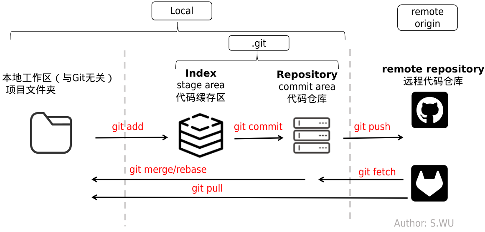

## 什么是GIT
Git是一个开源的**分布式版本控制系统**，用于敏捷高效地处理任何或小或大的项目。能跟踪**历史**，还可以记录每次**更新**，从而帮助开发者**追踪**代码的进展，并在需要的时候**回退版本**。

## 基本概念
- **Repository（仓库）**：仓库是一个存放项目代码的地方，每个仓库都有一个唯一的标识符，通常是一个URL。
- **Commit（提交）**：提交是对代码的一个快照，它记录了项目的历史记录，可以用来恢复到任意一个版本。
- **HEAD**：指向当前的最新提交
- **branch**: 分支，不同版本的代码可以放在不同的分支上，开发者可以自由切换分支，从而在不同版本之间进行开发。



### 基本命令
- `git diff [ARG]`
- `git init`
- `git add [FILE]`
     - **remark**: interactive mode: `git add -p`
- `git commit -m "message"`
- `git branch -D [BRANCH]` (删除一个分支)
- `git checkout -b [BRANCH]` (创建并切换到一个新分支)
- `git checkout [BRANCH]` (切换到一个已存在的分支)
- `git　clean -f(--force) -d(recursive directories) -x (all uncontrolled files) ` (删除未跟踪的文件)
- `git show` (显示提交信息)
- `git log` (显示提交历史)
- `git stash` (暂存当前工作区的修改)
    - `git stash pop` (恢复暂存区的修改)
- `git .gitignore` (忽略文件)

### 远程命令
- `git remote add [NAME] [URL]` (添加远程仓库)
- `git branch -r` (查看远程分支)
- `git branch -a` (查看所有分支)
- `git push [NAME] [BRANCH]` (推送本地分支到远程仓库)
- `git pull [NAME] [BRANCH]` (拉取远程分支到本地)
- `git fetch` (拉取远程仓库的最新数据)
- `git merge [BRANCH]` (合并分支)
- `git rebase [BRANCH]` (变基分支:非常重要且有用的功能，可以将一个分支的提交应用到另一个分支上)　　

个人一般常用的命令：
```bash
git fetch
git status
git rebase origin/main (git pull --rebase origin main)
```
确保你的commit是干净和线性的

### Git worktree
Git worktree 是 Git 2.5 引入的新特性，可以让你在同一个仓库下创建多个工作区，每个工作区都是一个完整的 Git 仓库，拥有自己的 HEAD、分支、暂存区、工作区等。

```bash
git worktree add [WORKTREE_NAME] [COMMIT]
git worktree list
git worktree prune
git worktree remove [WORKTREE_NAME]
```
