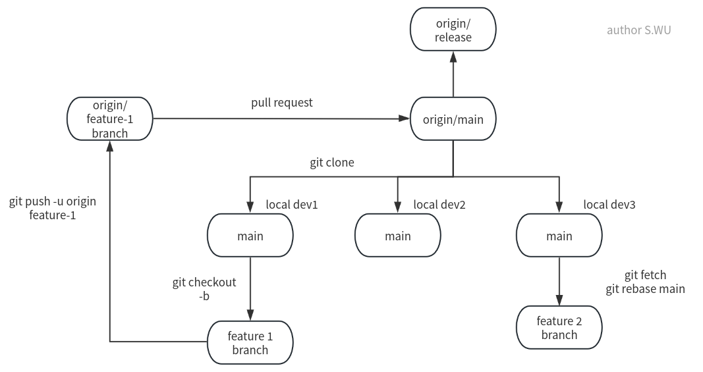
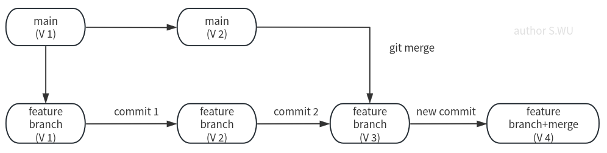
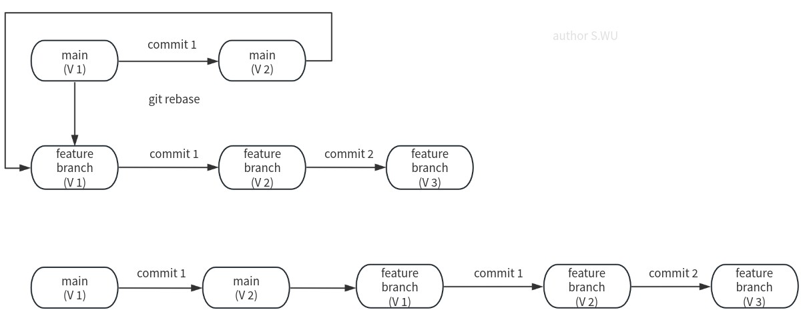

### 基于GIT的工作流（或者开发方式）有很多种。
这里主要介绍最常见的一种，叫做"**功能**（分支）工作流”:

各个开发者从本地克隆项目到自己的本地仓库，然后创建自己的分支。

然后，每个开发者在自己的分支上开发功能，完成后，向主分支提交代码。

主分支是项目的主干，所有开发者都可以向主分支提交代码（通过Pull Request）。

这种工作流的好处是：
- 各个开发者可以同时开发不同的功能，不会互相干扰。
- 主分支是稳定的，不会有代码冲突。
- 主分支可以作为发布版本的基线，可以快速迭代。
- 主分支可以作为集成测试的基线，可以快速发现问题。

## `git merge` VS. `git rebase`
`git merge` 和 `git rebase` 都是用来合并分支的命令。

`git merge` 是把分支合并到当前分支，会生成一个新的提交。

`git rebase` 是把分支变基到当前分支，不会生成新的提交。

同步远程代码的时候推荐使用`git fetch`+`git rebase`。这样可以保持当前分支的**线性**历史，不会出现分叉。

下面是两种方式的示例图：

`git merge`

`git rebase`

可以看见`git rebase`不会生成新的提交，而是把当前功能呢个分支分支变基，历史线性化。